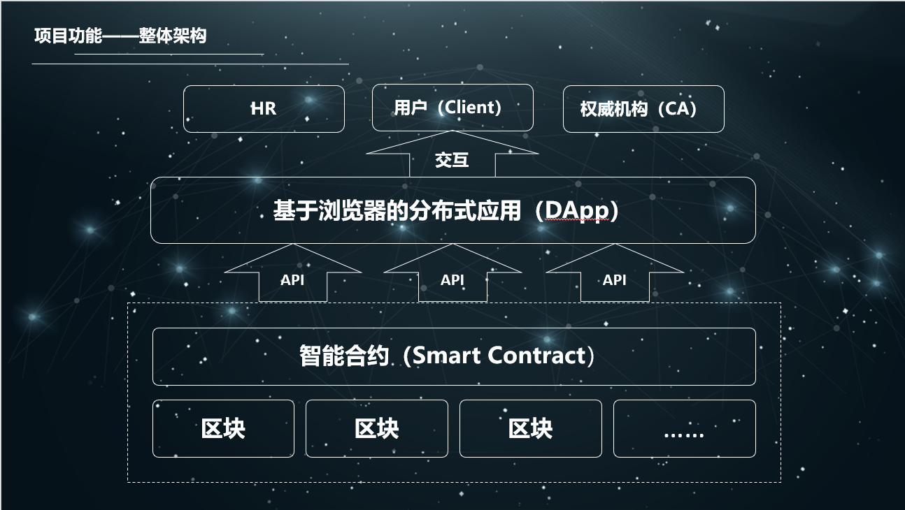
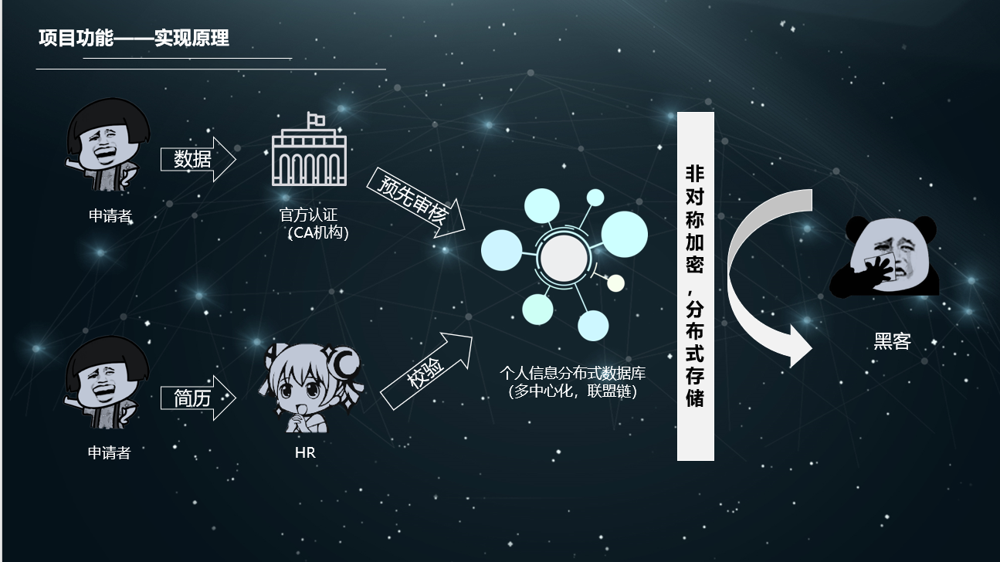
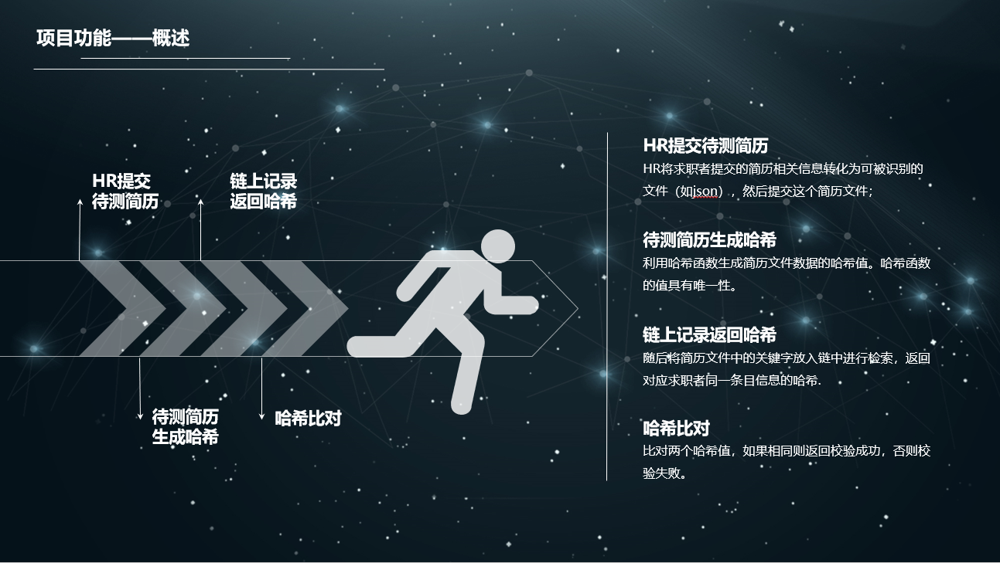

# 基于星云链的简历验证系统

Nebulas新App奖 https://incentive.nebulas.io/dapps-board.html#5

**Abstract**

With the rapid development of information technology and computer science,
blockchain has become an important role in various areas, especially cases like
verification or transaction in which trust is mostly needed. As a advanced
technology in blockchain service, permissioned blockchain can be very helpful in
resume verification to increase HR's efficiency.

**关键字**： 简历验证 分布式 区块链 

# 0. 测试系统

## step1

打开demo网页 http://nebulas.vaynetian.com

* 1.在右上角点击注册
* 2.填写用户名，密码，星云地址
* 3.点击注册
* 4.在右上角点击登陆
* 5.登陆刚才注册的账号

## step2
* 1.在左上角点击“我的简历”
* 2.输入一份简历demo
* 3.点击提交
* 4.可以看到待审核字样

## step3
* 1.在右上角注销
* 2.使用下面的管理员账号登陆（账号:manager 密码:123456）
* 3.点击右上角“个人中心”
* 4.可以看到刚才user提交的简历，点击“通过”，通过插件完成交易，这时会对公链进行上链操作
* 5.由于DPOS的共识，等待15s左右

## step4
* 1.点击验证简历
* 2.在step1下输入刚才简历中的名字，可以查询到简历哈希
* 3.在step2输入刚才的简历内容（在我的简历中可以查看，此处为方便展示管理员与user使用同一份“我的简历”“），点击验证，可以发现hash相同，验证成功
* 4.在step2输入简历，但可以修改其中一点内容，再进行验证，发现验证失败
* 5.在step3（模拟HR实际工作场景）中，点击“获取简历”，从json文件中读取2份简历（预先已经上链），点击验证，可以发现一份成功，另一份失败

# 1. 总览 Introduction

无论对于求职者还是企业来说，招聘都是一件很重要的事。刚刚走出大学校园的毕业生，满怀希望地将自己的简历发到HR的邮箱期待获得进一步面试的机会；HR看着邮箱中上百份的简历，每份简历中都有求职者各式各样的经历和成就，要么一眼扫过不加辨别，要么对其中的不同信息一一甄别。最后，不是求职者的机会减少，就是HR的效率降低，导致筛查时间变长，依然损伤了求职者的利益。

具体数据分析将在2.2节中详细阐述。

为了解决这一难题，一方面提高HR的工作效率，为企业高效地筛选所需人才，另一方面增加求职者的机会，使他们的简历可以被更认真的对待，我们提出了基于联盟链技术的简历验证系统。这一多中心化的系统将安全地储存求职者简历中的客观信息，使得HR可以利用计算机技术迅速的筛查简历中各种客观信息（成绩、获奖、论文、专利、实习等）的真实性，更注重和专心于求职者的主观表述，从而科学严谨地进行筛选。

这一系统的技术细节将在第3节中详细阐述。

区块链是一种去中心化的数据库技术，拥有对数据的可追溯性，数据的不可篡改性。因此在很多领域拥有广泛的前景并获得认可。

区块链技术背景将在2.3节中阐述。

区块链技术近年来发展极快，拥有强大的社区生态以及企业联盟。其开源开放的特性使得技术发展迅速，2009年中本聪的比特币系统[1]，区块链1.0时代开始。不久，代表着区块链2.0的拥有智能合约的以太坊社区出现[2]。IBM牵头的linux基金会企业的HyperLedger联盟链项目更是在商业化领域很快崭露头角。因此在不同的服务场景下，选用何种区块链技术也是一个需要仔细抉择的问题。

不同区块链技术的背景和特性将在第4节中讨论。

# 2. 背景 Background

### 2.1 问题的提出

HR对一个职位的应聘简历进行筛选时，会有自己独特的一些方法，但总绕不开对硬性（客观）条件的筛选判定。如果一位求职者声称自己毕业于浙江大学，有三项专利，HR如何迅速确定这份信息是真实的呢？诚然，在只有一份简历的情况下，HR可以去浙江大学的数据库去查有无此人，可以去国家专利库查询专利号，但是事实上，面对着大量的上百份的简历，HR对一份简历可以分配的时间可能只有不到一分钟，如果每一份简历都需要对硬性条件进行核查，将会极大降低效率。

当然，HR也可以假定这个人没有在简历上造假或是决定在面试时进行核查，于是给予了这位求职者面试机会。然而在面试时却发现求职者毕业于浙江大学城市学院，三项专利并不属于国家专利，于是不予录用，并且浪费了面试以及前前后后所需要的准备工作所花费的时间。

因此，为HR在这样的场景下可以提供怎样一个适当的解决方案呢？

### 2.2 需求分析

李开复说过：“如果是好的公司，一定会去确认履历里面的内容的。在我的工作经验中，曾经有一个人面试一个总经理的职位，结果很好，可是后来发现他的学历是假的，结果当然没雇。在好的公司，我们很高兴那些没有诚信的人在履历里作假，因为那增加了我们在雇用时抓到他的机会。建议你在履历之外，写一封热情洋溢，积极主动，充分描述你的专长和和优势，还有为什么你适合那个公司的信(cover
letter)。不要只谈些泛泛的话，要：（１）证明你花了时间去理解每一个申请对象，（２）用实例说明和证明你的专长、优势、诚意。”

可见，一份简历的真实性对于HR，对于公司都是十分重要的。

应届生论坛上的一份调查显示，有34%的参与者认为自己“简历很真实，绝对没有掺假”。而有超过10%的参与者承认自己简历造假，近50%的参与者承认夸大了自己的经历，只有约5%的参与者认为“造假迟早会被打回原形”。[3]

同时，他人简历造假行为与个人简历造假行为呈正相关关系[4]，也就是当简历造假之势愈演愈烈之时，很可能会形成潜规则或是风气。

从个人对简历造假的态度方面看，21. 4%认为简历造假是有必 要的；37.
5%的人认为简历适当修饰可以理解，表明有近六成人对简历修饰和造假表示认同。仅28.
3%的人鄙视简历造假。可见，人们对求职过程中的简历造假态度过于宽容，简历真实程度过低。此外，仅有17.
2%的被访者认为求职简历中作假不利于个人的求职，其余或多或少会认为简历作假是有利的。可见，社会上大部分人对简历作假存在一定的认识误区。[5]

从以上数据可以得知，简历注水造假是实际存在的严重问题。

### 2.3 区块链技术

区块链是分布式数据存储、点对点传输、共识机制、加密算法等计算机技术的新型应用模式。本质上是一个去中心化的数据库。
区块链是一串使用密码学方法相关联产生的数据块，每一个数据块中包含了交易的信息，用于验证其信息的有效性（防伪）和生成下一个区块。

# 3. 实现 Implement

### 3.1 流程

简历验证系统将分为两套操作流程：求职者的简历上传流程和HR的审核流程。

**3.1.1 求职者流程**

对于求职者来说，要做的事情其实和以前不会有非常大的区别，便利将是本系统的优势之一。

为了保证简历的真实性，求职者将不会拥有直接将信息上链的权限。这也是为何会使用拥有准入机制的联盟链技术而不是现有的公链，例如以太坊。只有CA机构将拥有对账本直接交互的权力，这在一定程度上与区块链去中心化的初衷相违背，但在真正的商业领域，极客化的完全去中心化理念并不是一个很好的选择，多中心化技术会是一种很好的平衡。

求职者有两种方式录入自己的信息。

-   一些信息本就被CA机构的数据库所储存（例如，大学会储存学生的GPA，论文发表情况，海外交流经历等信息），但HR需要去非常多的数据库进行调用和查询，因此可以将这些CA机构的信息直接导入。

-   另一些没有被很好的整理储存的个人数据，而求职者希望展现给HR，将可以通过自己填写表格发起申请，由专门的CA审核后存入区块链。

#### 3.1.2 HR流程

对于HR来说，使用本系统并不会对他们原来的操作有任何影响。它给予了HR一个信任前提——这些简历的客观信息都是真实可信的，在这个前提下HR进行简历的阅读和筛选，仅此而已。

以后的简历将会层次分明的分为两个部分：客观信息+主观阐述。客观信息是求职者从系统中直接调用下载的，有一定格式标准，这一部分在HR的计算机上通过比对哈希进行验证，速度极快。对HR没有技术上的要求。

### 3.2 Nebulas

本系统使用的区块链技术，来自国内领先的区块链团队Nebulas，利用其提供的RESTful
API，进行智能合约的部署，调用，查询。

#### 3.2.1 智能合约

本系统目前属于前期测试阶段，因此提供的功能非常简单，就是储存用户的简历，并且可以被查询。

合约包括三个函数 
* 增加简历 
* 查询简历 
* 删除简历

#### 3.2.2 RESTful API

Nebulas(https://github.com/nebulasio/wiki)提供了比较完整的REST API的接口。

-   部署节点

-   部署、实例化智能合约

-   调用智能合约（查询，插入，更新）

### 3.3 隐私保护

本系统面临一个很严重的问题，就是用户信息的隐私保护。这也是为什么这么多年来在中心化数据库发展非常成熟的情况下还没有这样一个平台诞生的原因，大量的用户信息被存在一个平台上，如果出现了黑客攻击或者是信息泄露，后果不堪设想。

区块链的安全性在目前来说是有保障的。从另一方面来说，并不是所有人都可以在链上查询到简历信息的明文，而是只有用户本人或者是CA才可以看见，其他人访问只能查询得到简历的哈希值用来校验，这些是以硬编码的形式利用智能合约来完成的，这也就满足了用户的隐私保护需求。

### 3.4 CA (Certificate Authority)

联盟链系统中CA机构可以参考目前https下CA的构成，可以进行分级，由顶级CA进行向下授权，下层CA可以由大学、期刊数据库等组成。这类CA负责信息的迁移，而另一类CA负责用户提交信息的审核，这部分服务可以进行适当的收费。

### 3.5 前端

现有的前端采用React框架，通过与REST
API交互获取数据并展示在网页上。网页组件采用了react-bootstrap的一些组件实例。

# 4. 展望 Discussion

### 4.1 HyperLedger Fabric

超级账本（hyperledger）是Linux基金会于2015年发起的推进区块链数字技术和交易验证的开源项目，目标是让成员共同合作，共建开放平台，满足来自多个不同行业各种用户案例，并简化业务流程。由于点对点网络的特性，分布式账本技术是完全共享、透明和去中心化的，故非常适合于在金融行业的应用，以及其他的例如制造、银行、保险、物联网等无数个其他行业。通过创建分布式账本的公开标准，实现虚拟和数字形式的价值交换，例如资产合约、能源交易、结婚证书、能够安全和高效低成本的进行追踪和交易。

HyperLedger Fabric是
HyperLedger多个同时孵化中的子项目之一。2016年6月，Hyperledger Fabric
v0.5开发版公布。截止目前，最新发布版本为2018年3月发布的Fabric-1.1.0。

Hyperledger
Fabric是一个用来部署和操作拥有准入机制的区块链（联盟链）的模块化可扩展的开源系统。Fabric目前已经被应用在超过400种跨行业的生产系统和分布式账本技术的原型与概念实现中。在不存在万能解决方案的前提下，Fabric是第一个可扩展的运行分布式程序的区块链系统。它支持通过模块化的共识算法定制特定的使用场景和信任模型。Fabric还是第一个对原生加密货币没有系统依赖性，并应用通用编程语言编写分布式程序的区块链。这和一些现在的主流区块链平台形成了鲜明对比，这些平台要么依赖于特定领域语言编写的智能合约，要么依赖于加密货币。此外，它还使用可插拔的成员资格的概念实现了一个准入模型，这将可能会与身份管理系统的行业标准结合。为了支持这种灵活性，Fabric用一种全新的方式实现了私有链的设计，并且改变了区块链处理不确定性、资源枯竭和性能攻击的问题。[6]

在简历验证系统的区块链选择上，Fabric由于其社区的活跃性，一直站在区块链最新技术的前沿，不失为一种好的选择。

### 4.2 中国个人档案系统

国家目前已经建立起一系列有关于个人信息的数据库系统，这些系统可以作为CA，参与将数据上链的过程，完成数据的去中心化储存。

#### 4.2.1 征信系统

2003年，国务院提出5年内建立起社会信用体系；十六届三中全会通过《关于完善社会主义市场经济体制若干问题的决定》提出：要形成以道德为支撑、产业为基础、法律为保障的社会信用体系；“十一五”规划指出要以完善信贷、纳税、合同履约、
产品质量的信用记录为重点，加快建设社会信用体制；2005年国务院《关于加快电子商务发展的若干意见》中强调：“加快社会信用体系建设”，并要求通过商业运作、专业服务尽快“建立科学、合理、权威、公正的信用服务机构。

#### 4.2.2 学生档案

中国高等教育学生信息网依托中心建立的集高校招生、学籍学历、毕业生就业和国家助学贷款学生个人信息一体化的大型数据仓库，开通了学历查询系统、学籍学历信息管理平台、“阳光高考”信息平台、硕士研究生网上报名和录取检查系统、国家助学贷款学生个人信息系统、学历认证网上办公系统、就业频道等多套电子政务系统和社会信息服务系统。2008年，中心基于新形势下转变政府职能，加强公共服务，全面服务大学生就业的需要，又开通了全国大学生就业公共服务立体化平台。

#### 4.2.3 中国国家知识产权局专利查询平台

http://www.sipo.gov.cn/zhfwpt/zljs/

国家知识产权局开通了网上的公开数据库查询系统，整理了所有注册过的专利信息。

### 4.3 企业联盟

本系统应用的难点不在于技术攻关，而是如何将平台做大，收集到尽可能多的信息，才会有求职者和HR去使用。那么如何推动这样一个平台的诞生呢？企业联盟将是一个很好的选择，一方面企业有自身人力资源的需求，也有资金去推动这个平台发展，另一方面企业联盟与联盟链的架构不谋而合，当更多的企业去作为一个背书节点维持一个账本时，平台的数据的安全性和可靠性就会进一步上升。

### 4.4 中国区块链行业发展

2017年区块链专利申请中，中国企业申请总数超过其他国家总和，其中阿里巴巴以43件排行第一，其中前20的企业中有13家来自中国。

诚然，专利数量并不能代表该领域领先程度，虽然在专利申请上，中国暂时领先，但专利方面的领先能不能说明申请专利只能作为领跑的一个原因，因为创新科技转化为生产力并不是一个简单的专利数量可以支撑起来的，这中间还需要长时间转化，当然还有其他更多的原因，包括产学研一体、应用落地、政策环境等等变量。

从产学研角度看，区块链是综合性技术，涵盖了密码学、计算机等学科，目前中国高校并没有开设区块链课程，接下来国内能否提供创新技术的孵化与人才，以及适合创新发展的环境尤为重要。接下来一段时间，同样需要高校在区块链创新中发光发热。

从应用落地看，大家公认的区块链应用目前来看只有以比特币为代表的数字货币，区块链技术在金融、征信、溯源、版权等领域的探索仍在试错阶段。从政策环境来看，2018年3月13日，工信部网站发布公告称，将筹建全国区块链和分布式记账技术标准化技术委员会，推进区块链和分布式记账技术的标准化进程。说明我国信息化发展的核心部门已经将区块链标准化纳入工作计划，进一步落实区块链应用进程。

参考文献
--------

1.  Satoshi Nakamoto.Bitcoin: A Peer-to-Peer Electronic Cash System.2008

2.  Etherrum.A Next-Generation Smart Contract and Decentralized Application
    Platform.2015

3.  杜鑫. 高校毕业生简历“注水”愈演愈烈.工人日报. 2012 年/11 月/25 日/第003 版

4.  王亚琼. 简历造假影响因素及机制研究.现代商贸工业. 1672-3198（2015）18-0099-04

5.  邵彩霞. 浙江省就业市场求职失信行为及其影响因素研究. 时代金融. 2017 年第05
    期中旬刊

6.  Elli Androulaki, Artem Barger, Vita Bortnikov, Christian Cachin,
    Konstantinos Christidis, Angelo De Caro, David Enyeart, Christopher Ferris,
    Gennady Laventman, Yacov Manevich, Srinivasan Muralidharan∗, Chet Murthy†,
    Binh Nguyen ∗, Manish Sethi, Gari Singh, Keith Smith, Alessandro Sorniotti,
    Chrysoula Stathakopoulou, Marko Vukoli´c, Sharon Weed Cocco, Jason
    Yellick.IBM.Hyperledger Fabric : A Distributed Operating System for
    Permissioned Blockchains.2018
